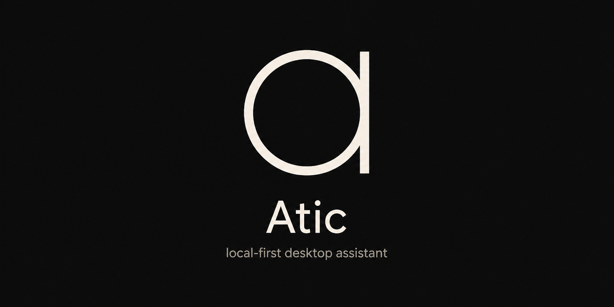

<p align="center">
  
</p>

<p align="center">
  Asistente de escritorio local-first.<br>
  Graba reuniones, dicta, captura y pega — sin ir a buscar una ventana.
</p>

<p align="center">
  <a href="LICENSE"></a>
  <a href="https://github.com/chrx3/atic/releases/latest"></a>
  <a href="https://github.com/chrx3/atic/actions/workflows/ci.yml"></a>
  
  
  
</p>

Atic vive en una **barra flotante** (la pill), la bandeja del sistema y atajos
globales. El audio se graba en tu PC; Whisper transcribe en local. Si eliges
Groq para dictado o live, ese audio sí sale a su API. Los resúmenes son BYOK:
solo viaja el texto, con la clave en el llavero del sistema.

**Windows** es la plataforma completa (mic + audio del sistema). En **macOS**
hoy se graba solo el micrófono.

Atic es **open source** ([MIT](LICENSE)). El desarrollo vive en
[`main`](https://github.com/chrx3/atic). Issues y PRs son bienvenidos.

## Qué hace

| | |
|---|---|
| **Reuniones** | Mic + sistema en pistas separadas, transcripción local, resumen editable, envío por correo. La detección de llamadas solo *sugiere* grabar. |
| **Dictado** | Atajo global (toggle o push-to-talk). Transcribe y pega donde estabas escribiendo. |
| **Clipboard** | Historial local de texto e imágenes. No archiva lo que un gestor de contraseñas marcó como efímero. |
| **Textos** | Snippets a propósito, más un bloc de notas. Distinto del historial: esto lo guardas tú. |
| **Capturas** | Ventana, región o monitor, al portapapeles y a un shelf flotante. |
| **Apps** | Launcher tipo Spotlight (mismo atajo que Ctrl+Space). |

Catálogo vivo (hechas, a medias e ideas): [`Features/`](Features/).

## Instalar

Descarga el último instalador en
[Releases](https://github.com/chrx3/atic/releases/latest):

- Windows: `*-setup.exe` (NSIS) — es lo que hay en el release actual
- macOS: compila desde el source ([`docs/MACOS.md`](docs/MACOS.md)); el DMG
  sale cuando hay cupo de CI

Windows puede mostrar SmartScreen: la app todavía no lleva firma Authenticode.
Los modelos de Whisper se bajan en el primer uso; no van dentro del instalador.

## Uso

1. La pill queda siempre encima. Clic (o el atajo de la rueda) abre las herramientas.
2. **Traer la pill** al cursor: atajo en Ajustes (por defecto `Ctrl+Shift+P`).
3. Grabar, dictar, capturar y el launcher tienen atajos globales propios.
4. La ventana principal es la biblioteca: grabaciones, transcript, resumen, Ajustes.

| Atajo | Acción |
|---|---|
| `Ctrl+Shift+R` | Iniciar / detener grabación |
| `Ctrl+Shift+D` | Dictado |
| `Ctrl+Shift+V` | Historial de portapapeles |
| `Ctrl+Shift+S` | Textos |
| `Ctrl+Shift+4` | Captura |
| `Ctrl+Shift+P` | Traer la pill al cursor |
| `Ctrl+Space` | Launcher |
| `Alt+Z` | Rueda de herramientas |

En Mac, `Ctrl` es `Cmd`. Todos se pueden cambiar en Ajustes.

Grabar a otras personas puede requerir consentimiento según el país. Atic
**nunca** graba solo: hace falta una acción tuya. La detección de llamadas no
aprieta el botón.

## Privacidad

- Grabaciones, transcripts, clipboard y logs viven en el disco local
  (`%APPDATA%\ciat\atic\data\` en Windows;
  `~/Library/Application Support/ciat/atic/data/` en Mac).
- Las API keys (Groq, Claude, OpenAI, …) y la contraseña SMTP van al **llavero
  del sistema**, no a `config.json`.
- No hay cuenta Atic ni telemetría de producto.

## Desarrollo

Compilar desde el source: [`docs/DEVELOPMENT.md`](docs/DEVELOPMENT.md)
(Windows, LLVM/CMake, empaquetado, updater). En Mac:
[`docs/MACOS.md`](docs/MACOS.md). Índice: [`docs/README.md`](docs/README.md).

```bash
git clone https://github.com/chrx3/atic.git
cd atic
cd apps/desktop
pnpm install
pnpm tauri dev
```

Ramas desde `main`, PRs hacia `main`. Cómo contribuir:
[`CONTRIBUTING.md`](CONTRIBUTING.md).
Vulnerabilidades: [`SECURITY.md`](SECURITY.md).
Comunidad: [`CODE_OF_CONDUCT.md`](CODE_OF_CONDUCT.md).

## Licencia

[MIT](LICENSE) · copyright [chrx3](https://github.com/chrx3).
Contribuir implica aceptar esa licencia.
